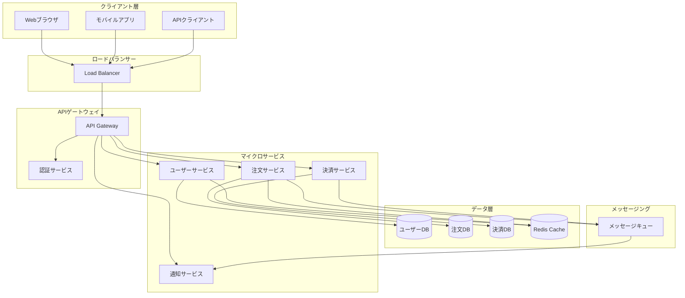
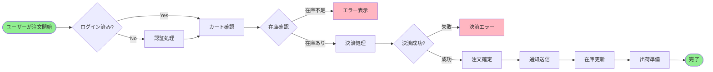
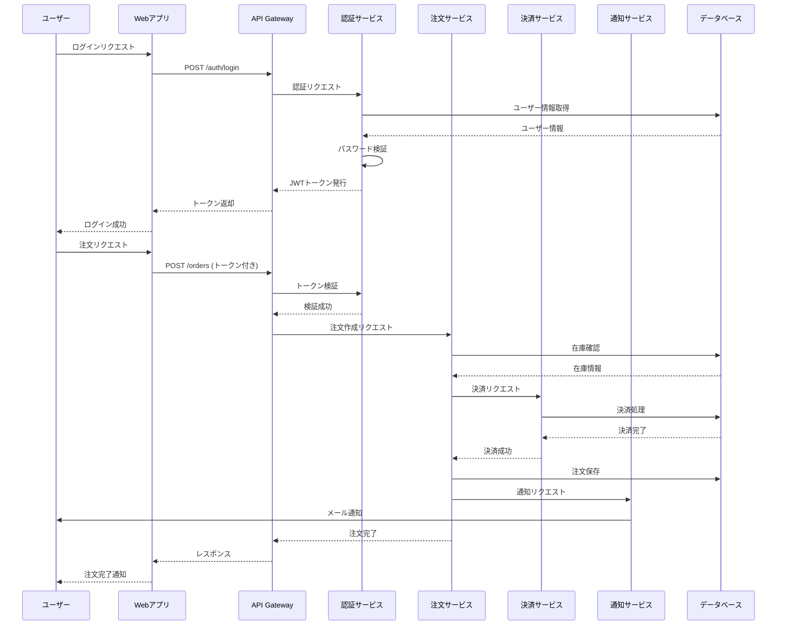
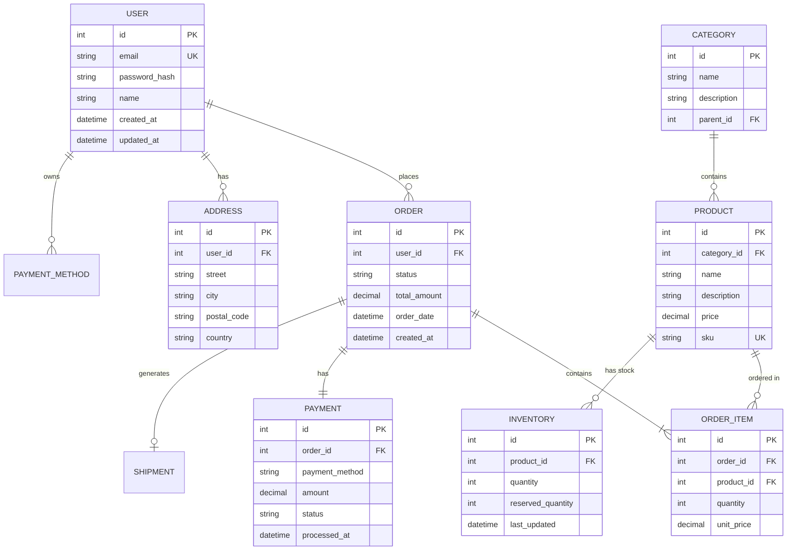
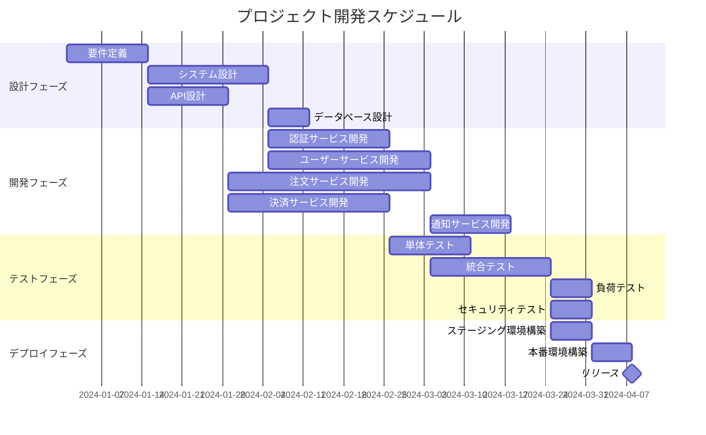
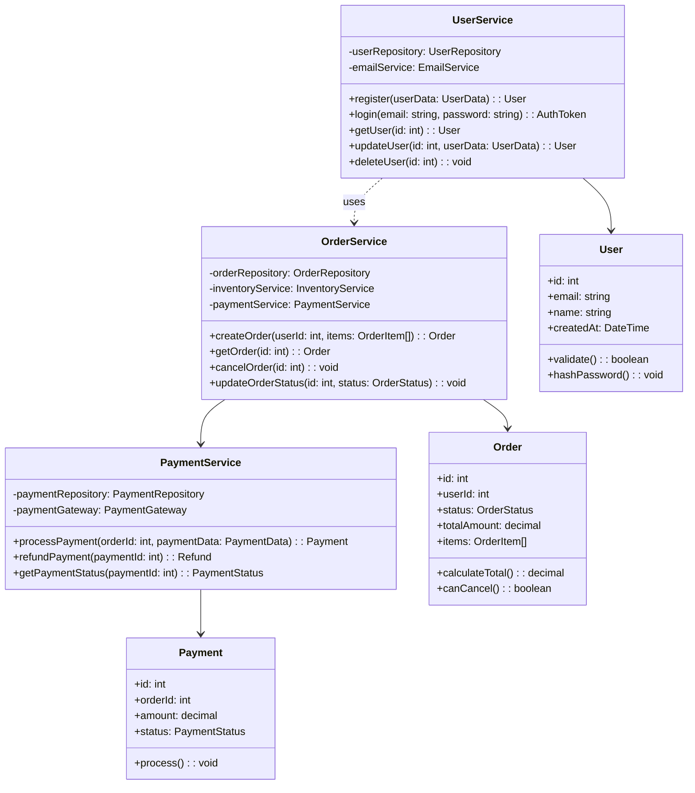
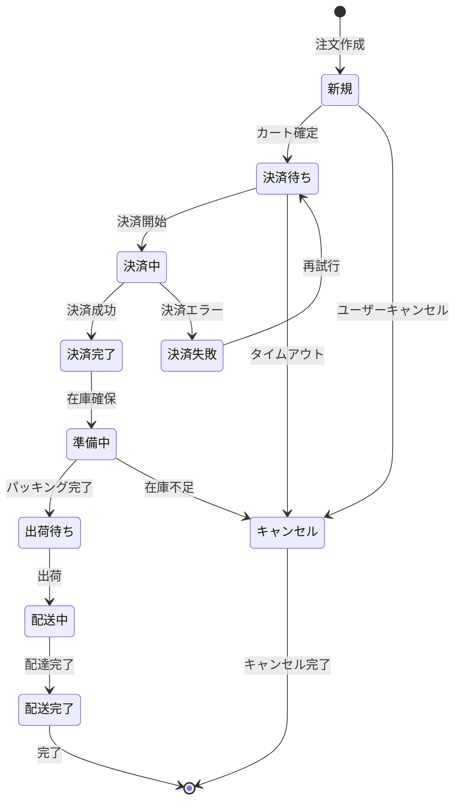

# システムアーキテクチャドキュメント

このドキュメントでは、システムの全体像、データフロー、プロセス、データベース設計などについて説明します。

## 目次

1. [システム概要](#システム概要)
2. [アーキテクチャ図](#アーキテクチャ図)
3. [データフロー図](#データフロー図)
4. [シーケンス図](#シーケンス図)
5. [データベース設計](#データベース設計)
6. [プロジェクトタイムライン](#プロジェクトタイムライン)
7. [クラス図](#クラス図)
8. [状態遷移図](#状態遷移図)
9. [画像ギャラリー](#画像ギャラリー)

---

## システム概要

本システムは、モダンなWebアプリケーションアーキテクチャを採用したマイクロサービス型の分散システムです。各サービスは独立してデプロイ可能で、RESTful APIを通じて通信します。

### 主な特徴

- **スケーラビリティ**: 水平スケーリングに対応
- **可用性**: 高可用性を実現するための冗長化設計
- **セキュリティ**: 認証・認可機能を内蔵
- **モニタリング**: 包括的なログとメトリクス収集

---

## アーキテクチャ図

システム全体のアーキテクチャを以下の図で示します。

### 説明

このアーキテクチャ図は、システムの3層構造を示しています：

1. **クライアント層**: Webブラウザ、モバイルアプリ、APIクライアントなどのエンドユーザーインターフェース
2. **アプリケーション層**: APIゲートウェイと複数のマイクロサービスで構成されるビジネスロジック層
3. **データ層**: 各種データベースとキャッシュシステム

ロードバランサーはトラフィックを分散し、APIゲートウェイは認証とルーティングを担当します。各マイクロサービスは独立したデータベースを持ち、メッセージキューを通じて非同期通信を行います。

---

## データフロー図

ユーザーが注文を完了するまでのデータフローを以下の図で示します。

### 説明

このフローチャートは、Eコマースシステムにおける注文処理の流れを示しています：

1. **認証チェック**: ユーザーがログインしているか確認
2. **カート確認**: カート内の商品を確認
3. **在庫確認**: 商品の在庫状況をチェック
4. **決済処理**: 決済情報を処理
5. **注文確定**: 決済成功後、注文を確定
6. **通知送信**: ユーザーと管理者に通知を送信
7. **在庫更新**: 在庫データを更新
8. **出荷準備**: 出荷プロセスを開始

各ステップでエラーが発生した場合、適切なエラーメッセージを表示し、プロセスを中断します。

---

## シーケンス図

ユーザー認証から注文完了までのシーケンスを以下の図で示します。

### 説明

このシーケンス図は、ユーザーがログインしてから注文を完了するまでの一連の処理を時系列で示しています：

1. **認証フェーズ**: ユーザーがログインし、JWTトークンを取得
2. **注文フェーズ**: 認証済みトークンを使用して注文リクエストを送信
3. **決済フェーズ**: 注文サービスが決済サービスに決済を依頼
4. **通知フェーズ**: 注文完了後、通知サービスがユーザーにメールを送信

各サービス間の通信はRESTful APIを通じて行われ、トークンベースの認証によりセキュリティが確保されています。

---

## データベース設計

システムで使用する主要なエンティティとその関係を以下のER図で示します。

### 説明

このER図は、Eコマースシステムの主要なエンティティとその関係を示しています：

- **USER**: システムのユーザー情報を管理
- **ORDER**: 注文情報を管理。ユーザーと1対多の関係
- **PRODUCT**: 商品情報を管理。カテゴリに属する
- **ORDER_ITEM**: 注文に含まれる商品の詳細情報
- **PAYMENT**: 決済情報を管理。各注文に1つの決済が紐づく
- **ADDRESS**: ユーザーの配送先住所
- **INVENTORY**: 商品の在庫情報
- **CATEGORY**: 商品カテゴリ。階層構造をサポート

各エンティティには適切な主キー（PK）と外部キー（FK）が設定され、データの整合性が保たれています。

---

## プロジェクトタイムライン

プロジェクトの開発スケジュールを以下のガントチャートで示します。

### 説明

このガントチャートは、プロジェクトの全体スケジュールを4つのフェーズに分けて示しています：

1. **設計フェーズ** (約6週間): 要件定義からデータベース設計まで
2. **開発フェーズ** (約9週間): 各マイクロサービスの開発を並行して実施
3. **テストフェーズ** (約5週間): 単体テストからセキュリティテストまで
4. **デプロイフェーズ** (約2週間): ステージング環境と本番環境へのデプロイ

各フェーズは依存関係を持ち、前のフェーズが完了してから次のフェーズに進むよう設計されています。

---

## クラス図

主要なサービスのクラス構造を以下の図で示します。

### 説明

このクラス図は、システムの主要なサービスクラスとその関係を示しています：

- **UserService**: ユーザー管理を担当するサービス。ユーザーの登録、認証、更新、削除を行う
- **OrderService**: 注文管理を担当するサービス。注文の作成、取得、キャンセル、ステータス更新を行う
- **PaymentService**: 決済処理を担当するサービス。決済の処理、返金、ステータス確認を行う

各サービスは対応するエンティティクラス（User、Order、Payment）を操作し、サービス間で連携してビジネスロジックを実現しています。

---

## 状態遷移図

注文の状態遷移を以下の図で示します。

### 説明

この状態遷移図は、注文が作成されてから完了（またはキャンセル）されるまでの状態変化を示しています：

1. **新規**: 注文が作成された初期状態
2. **決済待ち**: カートが確定され、決済を待っている状態
3. **決済中**: 決済処理が進行中
4. **決済完了**: 決済が成功した状態
5. **準備中**: 在庫を確保し、パッキングを準備している状態
6. **出荷待ち**: パッキングが完了し、出荷を待っている状態
7. **配送中**: 商品が配送されている状態
8. **配送完了**: 商品が配達された状態
9. **キャンセル**: 注文がキャンセルされた状態

各状態から適切な状態への遷移のみが許可され、ビジネスルールに従って状態管理が行われます。

---

## 画像ギャラリー

システムのUI画面やアーキテクチャの視覚的な説明を以下に示します。

### ダッシュボード画面

ダッシュボード画面では、システムの主要なメトリクスと統計情報を一目で確認できます。リアルタイムで更新されるグラフとチャートにより、システムの状態を把握しやすくなっています。

### システムアーキテクチャ概要図

この図は、システム全体のアーキテクチャを視覚的に表現したものです。各コンポーネントの配置と関係性が明確に示されています。

### データフロー概要

データがシステム内をどのように流れるかを示す図です。各ステップでのデータ変換と処理が視覚化されています。

### セキュリティモデル

システムのセキュリティアーキテクチャを示す図です。認証、認可、暗号化などのセキュリティ対策がどのように実装されているかを説明しています。

### デプロイメント図

システムがどのようにデプロイされるかを示す図です。各環境（開発、ステージング、本番）での構成が明確に示されています。

### モニタリングダッシュボード

システムのモニタリングとログ管理のためのダッシュボードです。パフォーマンスメトリクス、エラーログ、アラートなどを一元管理できます。

---

## 技術スタック

### フロントエンド
- **React**: ユーザーインターフェース構築
- **TypeScript**: 型安全性の確保
- **Tailwind CSS**: スタイリング
- **Redux**: 状態管理

### バックエンド
- **Node.js**: サーバーサイドランタイム
- **Express**: Webフレームワーク
- **PostgreSQL**: リレーショナルデータベース
- **Redis**: キャッシュとセッション管理
- **RabbitMQ**: メッセージキュー

### インフラストラクチャ
- **Docker**: コンテナ化
- **Kubernetes**: オーケストレーション
- **AWS**: クラウドインフラ
- **Nginx**: リバースプロキシとロードバランサー

### 開発ツール
- **Git**: バージョン管理
- **GitHub Actions**: CI/CD
- **Jest**: テストフレームワーク
- **ESLint**: コード品質管理

---

## パフォーマンス指標

### レスポンスタイム目標
- APIレスポンス: 200ms以下（p95）
- ページロード: 2秒以下
- データベースクエリ: 100ms以下

### 可用性目標
- アップタイム: 99.9%
- MTTR (平均復旧時間): 15分以下
- エラー率: 0.1%以下

### スケーラビリティ目標
- 同時接続数: 10,000以上
- 1秒あたりのリクエスト: 1,000以上
- データベース接続: 500以上

---

## セキュリティ対策

### 認証・認可
- JWTベースの認証
- OAuth 2.0サポート
- ロールベースアクセス制御（RBAC）
- 多要素認証（MFA）

### データ保護
- TLS/SSL暗号化
- データベース暗号化
- 機密情報の環境変数管理
- 定期的なセキュリティ監査

### 脆弱性対策
- 依存関係の定期的な更新
- セキュリティスキャンの自動化
- ペネトレーションテストの実施
- インシデント対応計画

---

## まとめ

このドキュメントでは、システムのアーキテクチャ、データフロー、データベース設計、開発スケジュールなどについて詳しく説明しました。各図表は、システムの異なる側面を視覚的に表現し、理解を深めるのに役立ちます。

システムは、スケーラビリティ、可用性、セキュリティを重視した設計となっており、モダンな技術スタックを採用することで、保守性と拡張性を確保しています。

---

**最終更新日**: 2024年1月15日  
**バージョン**: 1.0.0  
**作成者**: 開発チーム

